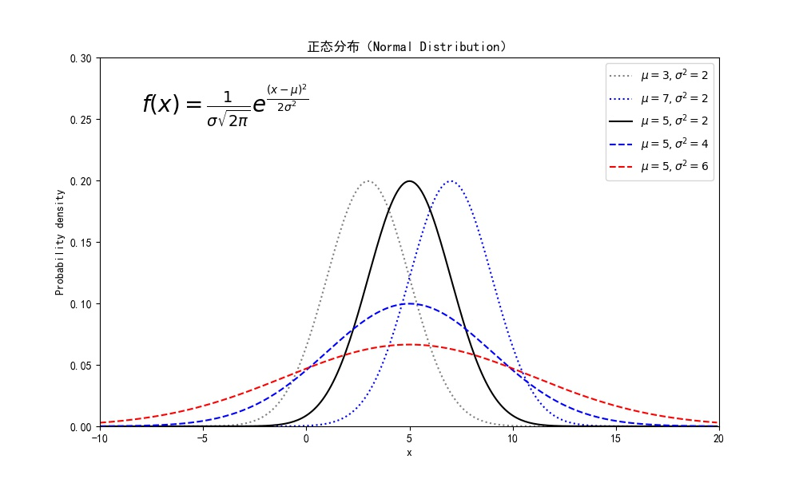
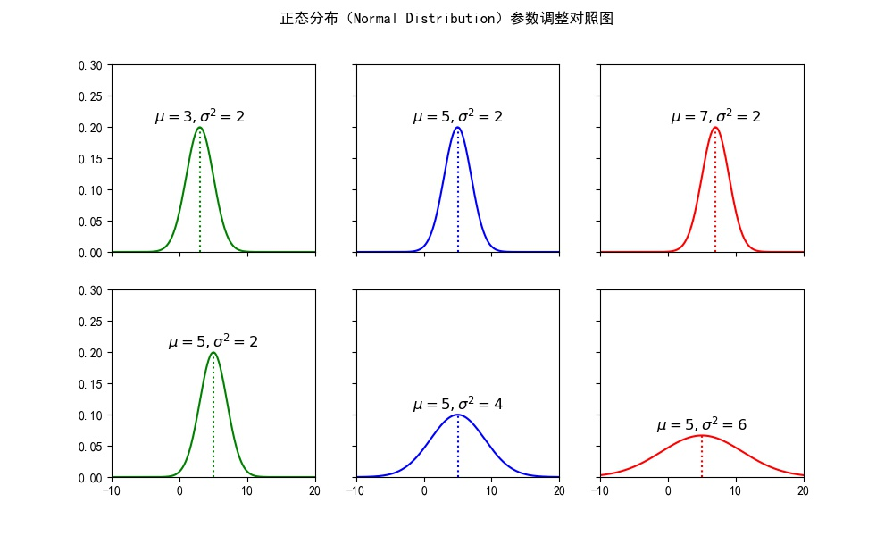
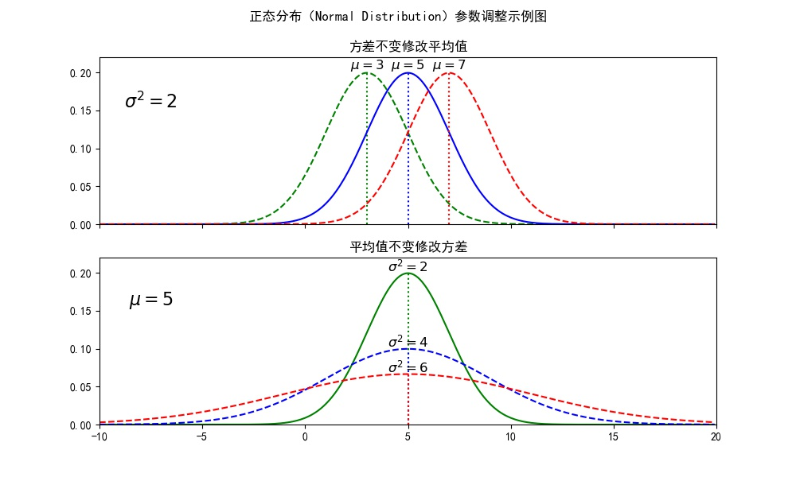
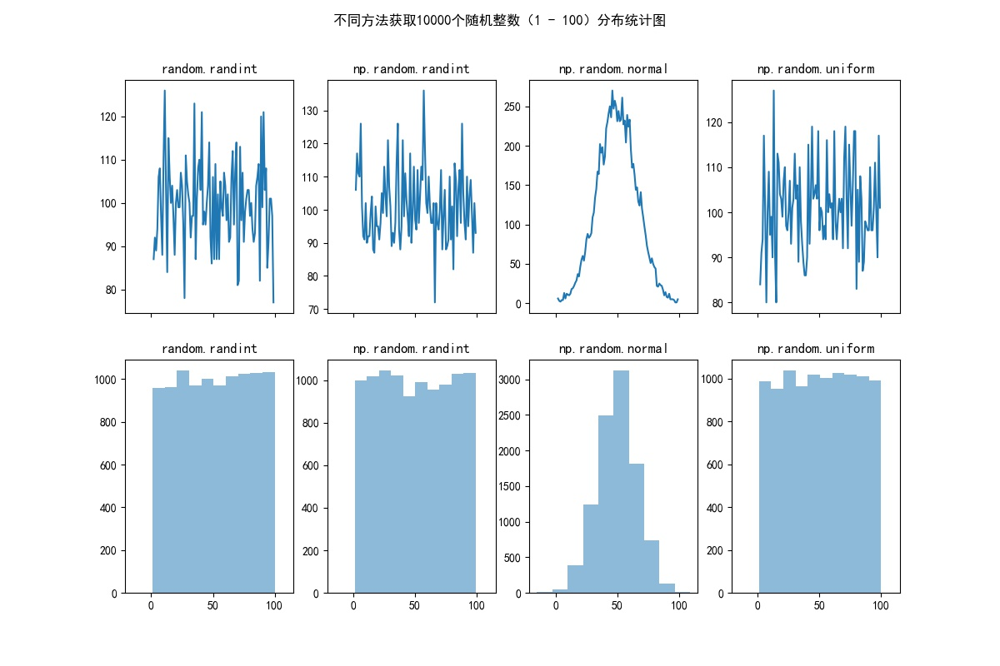

# LearnPythonStats

## [normal_distribution1.py](normal_distribution1.py)
### 正态分布的公式，以及参数变化合并对比图

## [normal_distribution2.py](normal_distribution2.py)
### 正态分布参数变化分隔6格对照图

## [normal_distribution3.py](normal_distribution3.py)
### 正态分布参数变化分隔2格对照图

## [random_distribution.py](random_distribution.py)
### 随机方法生成随机数后的分布对照图

## [test_result_analysis.py](test_result_analysis.py)
### 读取CSV文件，统计后绘图

## [股票数据统计分析专辑](STOCK.md)

