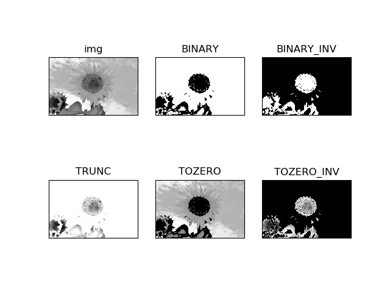

# 图像处理和识别专辑

## [cv_img_threshold1.py](cv_img_threshold1.py)
### 图像简单阈值处理

## [cv_img_threshold2.py](cv_img_threshold2.py)
### 图像自适应阈值处理

## [cv_img_filter1.py](cv_img_filter1.py)
### 图像滤波处理

## [cv_img_number1.py](cv_img_number1.py)
### 通过数字图片训练，然后识别图片中数字。

