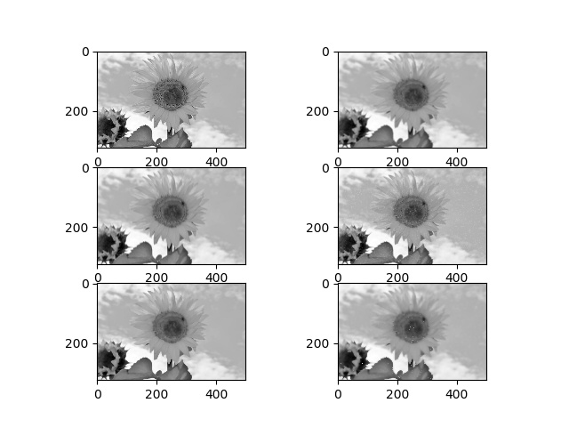

# 图像处理和识别专辑

## [cv_img_threshold.py](cv_img_threshold.py)
### 简单阈值，阈值在10～250间变化，五种参数的对比效果。

## [cv_img_threshold2.py](cv_img_threshold_adpt.py)
### 自适应阈值变化，块大小在5～126间变化，四种参数的对比效果。

## [cv_img_filter1.py](cv_img_filter1.py)
### 图像滤波处理

## [cv_img_number1.py](cv_img_number1.py)
### 通过数字图片训练，然后识别图片中数字。

