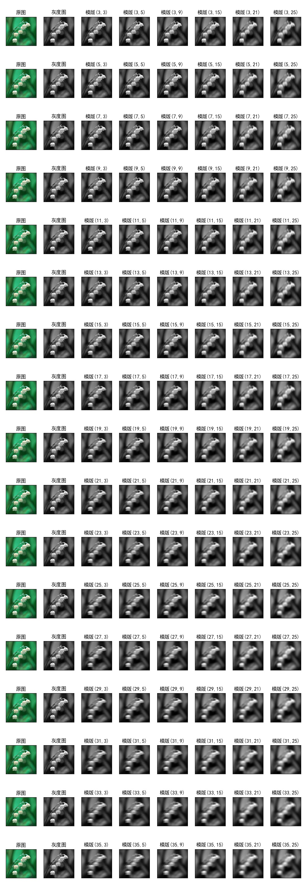

# 图像处理和识别专辑

## [cv_img_threshold.py](cv_img_threshold.py)
### 简单阈值cv2.threshold，阈值在10～250间变化，五种参数的对比效果。

## [cv_img_threshold_adpt.py](cv_img_threshold_adpt.py)
### 自适应阈值cv2.adaptiveThreshold，块大小在5～126间变化，四种参数的对比效果。

## [cv_img_filter2d.py](cv_img_filter2d.py)
### 统一的2D滤波器cv2.filter2D

## [cv_img_blur.py](cv_img_blur.py)
### 均值滤波cv2.blur

## [cv_img_blur_gaussian.py](cv_img_blur_gaussian.py)
### 高斯模糊滤波cv2.GaussianBlur

## [cv_img_blur_median.py](cv_img_blur_median.py)
### 中值滤波cv2.medianBlur

## [cv_img_blur_bilateral.py](cv_img_blur_bilateral.py)
### 双边滤波cv2.bilateralFilter

## [cv_img_number1.py](cv_img_number1.py)
### KNN数字图片训练识别(印刷体)

## [cv_img_number2.py](cv_img_number2.py)
### KNN数字图片训练识别(手写体)

