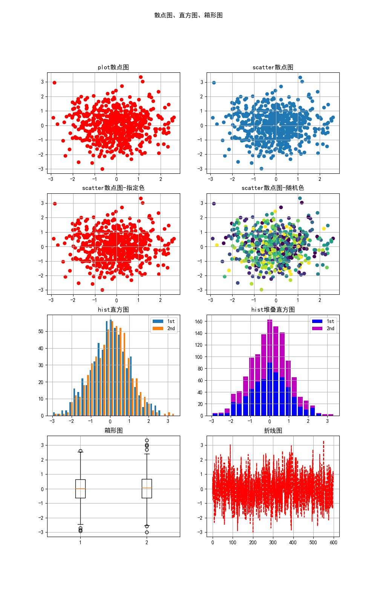

# 绘图专辑

## [draw_sin.py](draw_sin.py)
### 绘制三角函数波形图

## [draw_line1.py](draw_line1.py)
### 绘制常见函数线图

## [draw_line2.py](draw_line2.py)
### 绘制函数线图2(函数做参数)

## [draw_box.py](draw_box.py)
### 用正态分布的随机数，绘制散点图，直方图，箱形图

## [draw_triangulation1.py](draw_triangulation1.py)
### 绘制同心三角网，对分隔点数，层数变化，生成对比图。

## [draw_triangulation2.py](draw_triangulation2.py)
### 绘制3D同心三角网，对分隔点数，层数变化，生成对比图。

