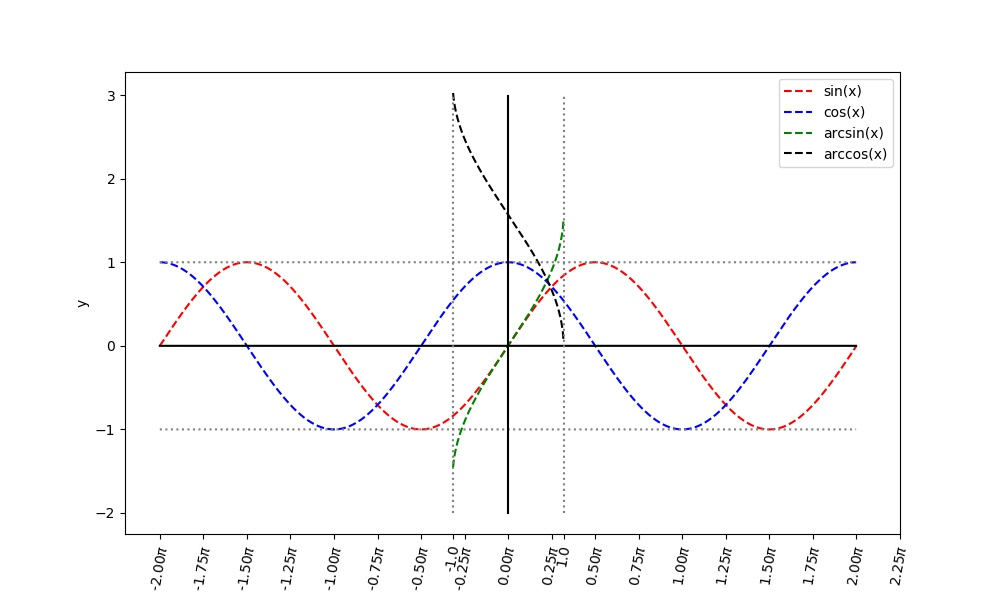

# 绘图专辑

## [draw_sin.py](draw_sin.py)
### 绘制三角函数波形图

## [draw_triangulation1.py](draw_triangulation1.py)
### 绘制同心三角网，对分隔点数，层数变化，生成对比图。

## [draw_triangulation2.py](draw_triangulation2.py)
### 绘制3D同心三角网，对分隔点数，层数变化，生成对比图。

