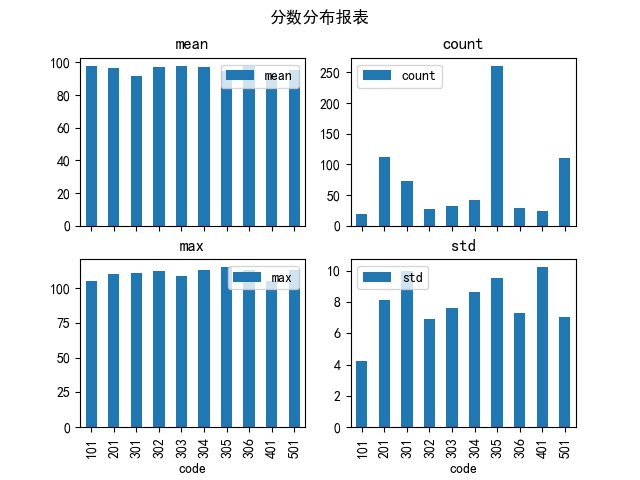

# 文件处理相关

## [file_analysis_csv.py](file_analysis_csv.py)
### 读取CSV文件，统计后绘图

## [file_load_xls.py](file_load_xls.py)
### 读取指定目录下的EXCEL文件，并根据每个文件的配置设定读取指定数据，最后汇总CSV输出

## [file_img_access.py](file_img_access.py)
### 图片文件的尺寸读取，尺寸压缩，文件复制移动。

## [file_compare1.py](file_compare1.py)
### 文件比较

