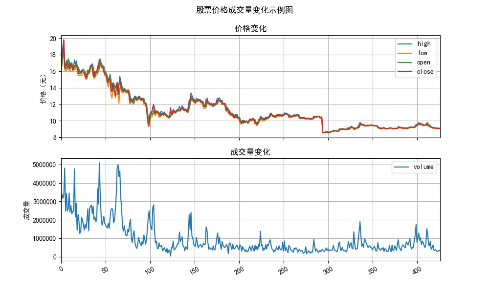
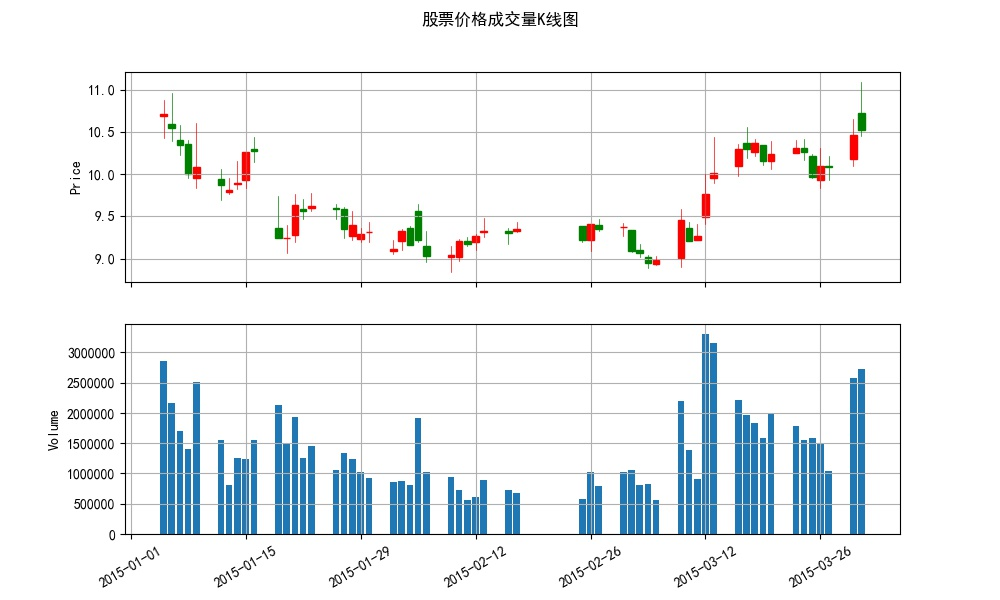

# Stock 股票统计分析相关

## [stock_line1.py](stock_line1.py)
### 根据股票的价格和成交量变化绘制变化图

## [stock_line2.py](stock_line2.py)
### 根据股票的价格和成交量变化绘制K线图

## [stock_diff1.py](stock_diff1.py)
### 根据股票的价格变化差分，判断是否属于平稳的时间序列

## [stock_diff2.py](stock_diff2.py)
### 根据股票的价格变化差分天数，以及P值，找到属于平稳的时间序列的差分天数

